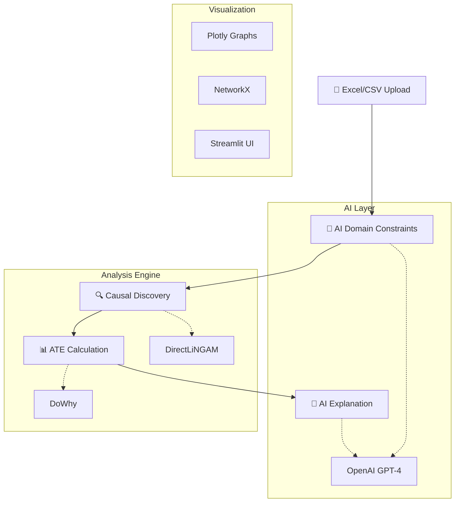

# 🔍 Advanced Causal Discovery Platform

A powerful Streamlit-based web application for exploring causal relationships between variables using AI-powered analysis. This platform combines DirectLiNGAM causal discovery, DoWhy causal inference, and OpenAI GPT-4 for comprehensive business insights.

## 🎯 Live Demo
🌐 **[Try the Live App](https://your-app-name.streamlit.app)** - No installation required!

## 📖 Description

This application provides an end-to-end causal analysis pipeline featuring:

- 📁 **Excel/CSV File Upload**: Easy data import with validation
- 🤖 **AI-Powered Domain Constraints**: LLM generates business-relevant causal rules
- 🔍 **Real-time Causal Discovery**: DirectLiNGAM algorithm with constraint support
- 📊 **Average Treatment Effect (ATE)**: Statistical causal inference using DoWhy
- 🧠 **AI Result Interpretation**: GPT-4 powered business insights
- 📈 **Interactive Visualizations**: Professional graphs and dashboards

## 🌟 Platform Architecture



### 🧠 What is Causal Discovery?

Causal discovery identifies **cause-and-effect relationships** from data, going beyond correlation to understand:

```
📈 Correlation: Sales ↔ Marketing Spend (related, but which causes which?)
🎯 Causation: Marketing Spend → Sales (clear direction of influence)
```

**Business Impact:**
- 💰 **ROI Optimization**: Focus budget on true drivers
- 🎯 **Strategic Planning**: Understand intervention effects  
- ⚡ **Risk Management**: Predict unintended consequences
- 🚀 **Competitive Edge**: Data-driven decision making

## 🚀 Quick Start

### Option 1: Use Online (Recommended)
1. 🌐 Visit the [live demo](https://your-app-name.streamlit.app)
2. 📁 Upload your Excel/CSV file or try sample data
3. 🤖 Let AI generate domain constraints
4. 🔍 Run causal discovery
5. 📊 Calculate treatment effects
6. 🧠 Get AI-powered insights

### Option 2: Local Development

```bash
# 1. Clone and setup
git clone <your-repository-url>
cd causal-discovery-app

# 2. Create virtual environment
python -m venv venv
# Windows: venv\Scripts\activate
# Mac/Linux: source venv/bin/activate

# 3. Install dependencies
pip install -r requirements.txt

# 4. Run locally
streamlit run streamlit_app.py
```

## 📊 Complete Analysis Workflow

### Step 1: Data Upload & Preview
```python
# Supported formats: .xlsx, .csv
# Automatic data validation and statistics
```


### Step 2: AI Domain Constraints
```python
# Example business context:
"This is marketing data where customer demographics 
come before purchase decisions, and ad spend affects 
sales but not customer age..."

# AI generates:
{
  "forbidden_edges": [["Sales", "Customer_Age"]],
  "required_edges": [["Ad_Spend", "Sales"]],
  "temporal_order": ["Customer_Age", "Ad_Spend", "Sales"]
}
```


### Step 3: Interactive Causal Graph
```python
# DirectLiNGAM discovers relationships
# Plotly creates interactive visualizations
```


### Step 4: Treatment Effect Analysis
```python
# DoWhy calculates Average Treatment Effect (ATE)
# Statistical validation with confidence intervals
```


### Step 5: Business Insights
```python
# GPT-4 powered explanations:
"A $1000 increase in marketing spend increases sales by $2,847 
on average (95% CI: $2,234 - $3,460). This relationship is 
statistically significant (p < 0.001), suggesting marketing 
is an effective investment..."
```


## 🏗️ Technical Architecture

### Core Components

```python
class CausalAnalyzer:
    """Main orchestrator for causal analysis pipeline"""
    
    def load_data(self, file) -> bool:
        """📁 Handle Excel/CSV upload with validation"""
        
    def generate_domain_constraints(self, context) -> Dict:
        """🤖 AI-powered constraint generation"""
        
    def run_causal_discovery(self, constraints) -> bool:
        """🔍 DirectLiNGAM with domain knowledge"""
        
    def calculate_ate(self, treatment, outcome) -> Dict:
        """📊 DoWhy causal inference"""
        
    def explain_results_with_llm(self, results) -> str:
        """🧠 GPT-4 business interpretation"""
```

### Dependencies & Tech Stack

```txt
streamlit==1.28.0      # 🎨 Web framework
lingam==1.8.2          # 🔍 Causal discovery
dowhy==0.10.1          # 📊 Causal inference  
openai==1.3.0          # 🤖 AI integration
plotly==5.17.0         # 📈 Interactive viz
networkx==3.1          # 🕸️ Graph analysis
pandas==2.0.3          # 📋 Data manipulation
numpy==1.24.3          # 🔢 Numerical computing
```

## 🎯 Business Use Cases & Examples

### 🛒 E-commerce Analytics
```
Question: "What drives online sales?"
Discovered: Customer_Reviews → Trust_Score → Purchase_Intent → Sales
Insight: Improving review quality increases sales by 23%
Action: Invest in review management system
```

### 📱 Marketing Optimization  
```
Question: "Which channels drive conversions?"
Discovered: Social_Media → Brand_Awareness → Website_Traffic → Conversions
Insight: Social media has 3x ROI compared to paid ads
Action: Reallocate 40% budget to social media
```

### 🏥 Healthcare Outcomes
```
Question: "What improves patient satisfaction?"
Discovered: Staff_Training → Service_Quality → Patient_Experience → Satisfaction
Insight: Each hour of training increases satisfaction by 0.8 points
Action: Implement monthly training programs
```

### 🏭 Manufacturing Quality
```
Question: "What causes defects?"
Discovered: Temperature → Material_Quality → Process_Speed → Defect_Rate
Insight: Temperature control reduces defects by 45%
Action: Upgrade cooling systems
```

## 🌐 Deployment Options

### ⭐ Streamlit Community Cloud (Best for Startups)

**Why Choose This:**
- ✅ **Free Forever**: No time limits or usage restrictions
- ✅ **Professional URLs**: `your-app.streamlit.app`
- ✅ **Auto-Deploy**: Push to GitHub → Live in minutes
- ✅ **Perfect for Demos**: Always available for clients
- ✅ **Zero DevOps**: Focus on your product, not infrastructure

**Deployment Steps:**
1. 📤 Push code to GitHub (public repo)
2. 🌐 Visit [share.streamlit.io](https://share.streamlit.io)
3. 🔗 Connect GitHub account
4. 🚀 Select repository → Deploy
5. ✅ Live at `https://your-repo-name.streamlit.app`

### 🔧 Configuration Setup

**OpenAI API Key:**
```python
# Option 1: Streamlit sidebar input
api_key = st.text_input("OpenAI API Key", type="password")

# Option 2: Streamlit secrets
# Create .streamlit/secrets.toml:
# OPENAI_API_KEY = "your-key-here"
```

**App Customization:**
```toml
# .streamlit/config.toml
[theme]
primaryColor = "#FF6B6B"        # 🎨 Brand colors
backgroundColor = "#FFFFFF"
secondaryBackgroundColor = "#F0F2F6"

[server]
maxUploadSize = 200             # 📁 200MB file limit
```

## 📈 Performance & Scalability

### Optimization Features
- ⚡ **Streamlit Caching**: Fast repeated analyses
- 🔄 **Incremental Updates**: Only rerun changed components  
- 📊 **Efficient Algorithms**: Optimized DirectLiNGAM implementation
- 🤖 **Smart AI Calls**: Cache LLM responses to reduce costs

### Scaling Considerations
```python
# For larger datasets (>10k rows):
@st.cache_data
def process_large_dataset(df):
    # Sampling strategy for demo purposes
    if len(df) > 10000:
        return df.sample(10000)
    return df
```

## 🎯 Client Demo Strategy

### 🎪 Demo Script Template

**Opening (2 min):**
```
"Today I'll show you how AI can automatically discover 
what truly drives your business metrics. This isn't just 
correlation - we're finding actual cause-and-effect relationships."
```

**Data Upload (1 min):**
```
"Simply upload your Excel file - the system handles 
everything automatically with data validation and preview."
```

**AI Constraints (2 min):**
```
"Here's where it gets smart. I describe our business context 
and AI generates domain-specific rules. This ensures 
realistic, business-relevant results."
```

**Causal Discovery (2 min):**
```
"One click and we discover the causal network. These arrows 
show direction of influence - what actually drives what."
```

**Treatment Effects (2 min):**
```
"Now the key question: if we change X by this amount, 
what happens to Y? This gives you the ROI of interventions."
```

**AI Insights (1 min):**
```
"Finally, AI translates statistical results into actionable 
business recommendations. No PhD required!"
```

### 💼 Value Proposition Highlights

- **Speed**: "Analysis that used to take weeks now happens in minutes"
- **Accuracy**: "AI-guided constraints ensure realistic results"  
- **Actionability**: "Clear ROI calculations for every intervention"
- **Accessibility**: "No technical expertise required"

## 🔬 Advanced Features

### Algorithm Selection
```python
# Future enhancement: Multiple algorithms
algorithms = {
    "DirectLiNGAM": "Linear relationships, non-Gaussian noise",
    "ICALiNGAM": "Independent Component Analysis variant", 
    "VARLiNGAM": "Time series causal discovery"
}
```

### Custom Visualizations
```python
# Interactive network with edge weights
fig = go.Figure()
fig.add_trace(go.Scatter(
    x=edge_x, y=edge_y,
    mode='lines',
    line=dict(width=3, color='gray'),
    hovertemplate='Causal Strength: %{text}<extra></extra>',
    text=[f"{weight:.3f}" for weight in edge_weights]
))
```

### Statistical Validation
```python
# Robustness checks
validation_methods = [
    "Random Common Cause",
    "Placebo Treatment", 
    "Data Subset Validation",
    "Bootstrap Confidence Intervals"
]
```

## 📚 Learning Resources

### 📖 Causal Discovery Deep Dive
- [The Book of Why - Judea Pearl](https://www.amazon.com/Book-Why-Science-Cause-Effect/dp/0465097618) - **Must read for understanding causality**
- [Causal Inference: The Mixtape](https://mixtape.scunning.com/) - **Free online textbook with practical examples**
- [Microsoft DoWhy Documentation](https://microsoft.github.io/dowhy/) - **Official DoWhy guide**

### 🔬 Technical Implementation
- [DirectLiNGAM Paper](https://www.jmlr.org/papers/volume7/shimizu06a/shimizu06a.pdf) - **Original algorithm paper**
- [LiNGAM Python Package](https://lingam.readthedocs.io/) - **Complete documentation**
- [Streamlit Documentation](https://docs.streamlit.io/) - **Web app development**

### 🎯 Business Applications
- [Causal AI for Business](https://www.oreilly.com/library/view/causal-ai-for/9781492090052/) - **Business-focused approach**
- [HBR: The New Science of Cause and Effect](https://hbr.org/2019/05/the-new-science-of-cause-and-effect) - **Business strategy implications**

## 🚀 Future Roadmap

### Phase 1: Core Platform ✅
- [x] Excel/CSV upload
- [x] AI domain constraints  
- [x] Causal discovery
- [x] ATE calculation
- [x] AI explanations

### Phase 2: Enhanced Analytics 🔄
- [ ] Time series causal discovery
- [ ] Multiple algorithm support
- [ ] Advanced statistical tests
- [ ] Custom visualization themes

### Phase 3: Enterprise Features 📋
- [ ] User authentication
- [ ] Team collaboration
- [ ] API integration
- [ ] Custom branding
- [ ] Advanced security

### Phase 4: AI Evolution 🤖
- [ ] Multi-modal AI (vision + text)
- [ ] Domain-specific models
- [ ] Real-time learning
- [ ] Automated insights

## 📞 Support & Community

### Getting Help
- 🐛 **Bug Reports**: [GitHub Issues](https://github.com/your-repo/issues)
- 💬 **Questions**: [GitHub Discussions](https://github.com/your-repo/discussions)  
- 📧 **Business Inquiries**: your-email@company.com

### Contributing
We welcome contributions! Areas where help is needed:
- 🔬 **Algorithm Implementation**: New causal discovery methods
- 🎨 **UI/UX Improvements**: Better visualizations and user experience
- 📖 **Documentation**: Tutorials and examples
- 🧪 **Testing**: Unit tests and validation cases

---

**🎯 Built for startups and enterprises who want to make data-driven decisions based on causal evidence, not just correlation.**

**💡 Turn your data into actionable insights with AI-powered causal discovery.**